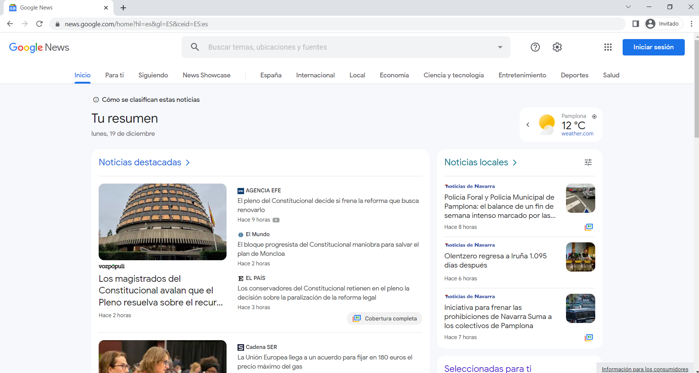
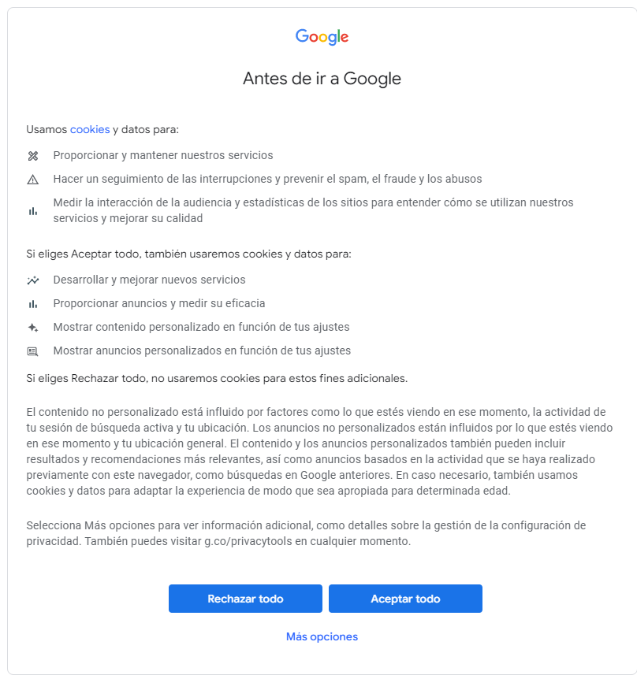
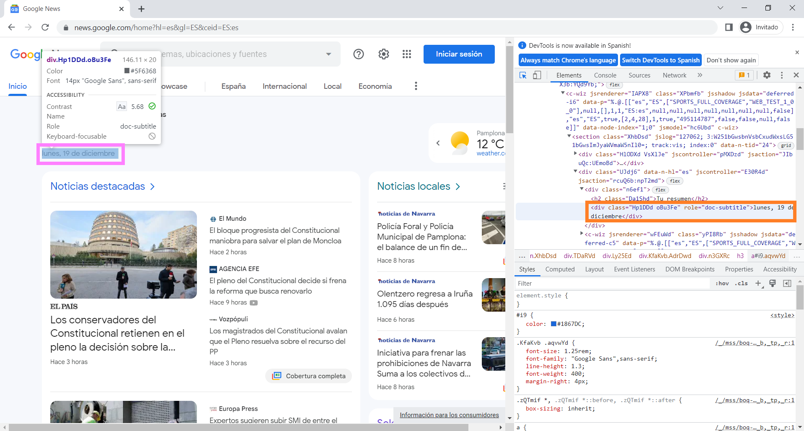
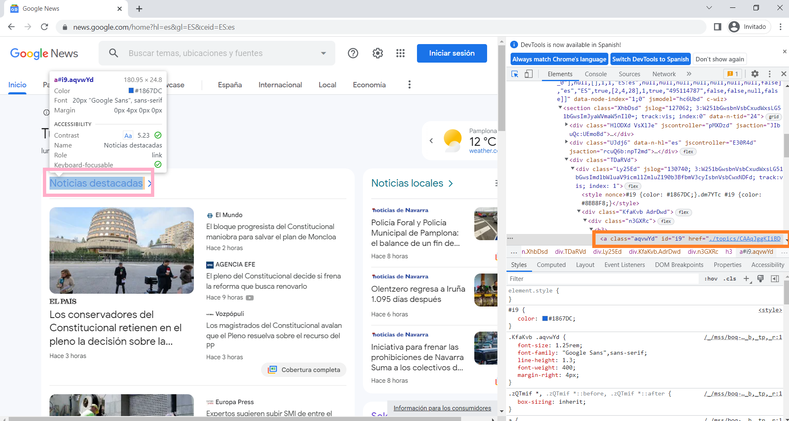
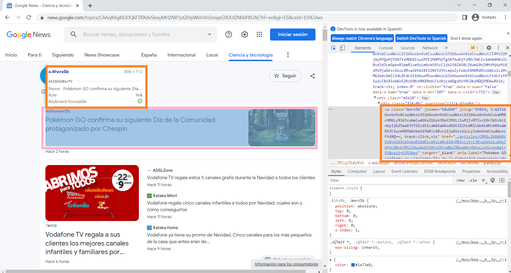

## Técnicas de Recogida de Datos - Master Oficial Big Data Science UNAV


### PROYECTO FINAL - 19/12/2022

#### Realizado por: Elena Martín de Diego emartindedi@alumni.unav.es

---


## Índice  <a name="indice"></a>

- [Objetivos](#obj)
- [Importacion de las librerias](#lib)
- [Clase GoogleNews](#GoogleNews)
  - [Atributos](#atr)
  - [Métodos](#met)
    - [define\_options\_scraper](#define_options_scraper)
    - [open\_google\_news](#open_google_news)
    - [get\_topics](#get_topics)
    - [analize\_sentiment](#analize_sentiment)
    - [generate\_data](#generate_data)
    - [summary](#summary)
  - [Gestión de la clase](#manage)
- [Requerimientos para el correcto funcionamiento](#req) 
- [Pasos futuros](#future)

---

# Objetivos<a name="obj"></a> 
[Volver al índice](#indice)

El objetivo principal de este proyecto es poner en practica las técnicas estudiadas a lo
largo de la asignatura `Técnicas de Recogida de Datos` del Máster Oficial en Big Data Science, como 
puede ser el escrapeo de páginas web para la obtención de datos.
En concreto, se extraerá información de la página web de Noticias de Google (https://news.google.com/) haciendo 
uso de librerías como Selenium.



---


# Importacion de las librerias<a name="lib"></a> 
[Volver al índice](#indice)

```python
import time
import datetime
import os
import time
import requests
from pprint import pprint
from bs4 import BeautifulSoup
import pandas as pd
import json
from lxml import html
import re
import csv
import numpy as np
import sys
import traceback
from selenium import webdriver
from webdriver_manager.chrome import ChromeDriverManager
from selenium.webdriver.common.action_chains import ActionChains
from selenium.webdriver.remote.webelement import WebElement
from selenium.webdriver.common.by import By
from selenium.webdriver.common.keys import Keys
from selenium.webdriver.support import expected_conditions as EC
from selenium.webdriver.support.ui import WebDriverWait
from selenium.webdriver.chrome.options import Options
from selenium.common.exceptions import (
    NoSuchElementException,
    TimeoutException,
    WebDriverException,
    )
from textblob import TextBlob
import re
```


# Clase GoogleNews<a name="GoogleNews"></a> 
[Volver al índice](#indice)

## Atributos<a name="atr"></a> 
[Volver al índice](#indice)

Para gestionar este proyecto se ha creado un objeto clase de Python llamado *GoogleNews* con 
los atributos: 
```python
url: str = "https://news.google.com/"
opened: bool
topics: list = []
topics_urls: list = []
data: dict = {}
inicio: None
fin: None
```
* La url es una cadena con la url de la página web de Google News
* opened es un booleano que será True cuando se haya podido abrir correctamente la página web y
False en caso contrario
* La lista topics contendrá todos los temas de los que se puede elegir extraer informacion a 
excepcion de 'Para ti' y 'Siguiendo' debido a que requieren registrarse con una cuenta de google.
* data será un diccionario que contendrá la información deseada, ordenada por las claves: 'Fecha', 
'Ultima actualizacion', 'Topic', 'Fuente', 'Resumen noticia', 'Link', 'Analisis sentimental'.
* inicio y fin son el dato temporal de cuando se inicia a ejecutar el programa y cuando termina


## Métodos<a name="met"></a> 
[Volver al índice](#indice)

Los métodos de la clase GoogleNews se describen a continuación.

### define_options_scraper<a name="define_options_scraper"></a> 
[Volver al índice](#indice)

`define_options_scraper` es usado para configurar la apariencia de la pestaña de Google Chrome 
cuando es abierta automaticamente.

```python
def define_options_scraper(self):
    """Configurating the web page appearance"""
    options = Options()
    user_agent = 'Mozilla/5.0 (Macintosh; Intel Mac OS X 10_12_3) AppleWebKit/5\ 37.36 (KHTML, like Gecko) Chrome/56.0.2924.87 Safari/537.36'
    options.add_argument(f'user-agent={user_agent}')
    options.add_argument('--window-size=920,1480')
    options.add_argument('--headless')  # Headless mode
```

### open_google_news<a name="open_google_news"></a> 
[Volver al índice](#indice)

`open_google_news` es la encargada de abrir una pestaña nueva de Google Chrome, en el caso posible, y pinchar en la opción de 'Aceptar todo' como 
se muestra en la imagen. Si ha podido acceder a la página web actualiza el atributo opened a True y en caso contrario a False.



```python
def open_google_news(self, driver):
    """Open the web page contained in the url attribute of the class
    :param: driver selenium object
    :return: boolean object if it was opened the web page correctly and accepted the consent"""
    r = requests.get(self.url + "home?hl=es&gl=ES&ceid=ES:es.hlml")
    if r.status_code == 200:
        # If status is equal to 200 it means that the web can be opened correctly
        driver.get(self.url)
        time.sleep(7)
        # Accept the consent button
        consent = driver.find_element(by=By.CSS_SELECTOR,
                                      value='button.VfPpkd-LgbsSe.VfPpkd-LgbsSe-OWXEXe-k8QpJ.VfPpkd-LgbsSe-OWXEXe-dgl2Hf.nCP5yc.AjY5Oe.DuMIQc.LQeN7.Nc7WLe')
        consent.click()
        self.opened = True
    else:
        self.opened = False
```

### get_topics<a name="get_topics"></a> 
[Volver al índice](#indice)

`get_topics` extrae todos las opciones de temas posibles de
obtención de información de Google. Tiene como input el driver y devuelve tanto 
una lista con los temas posibles como otra lista con los links respectivos (guardada en un atributo
para poder acceder más adelante). Notar que 'Para ti' y 'Siguiendo' son omitidos al 
tener que crear una cuenta en Google para acceder y por la diversidad de noticias en función de 
aspectos ajenos al trabajo.


```python
def get_topics(self, driver):
    """Function to obtain the possible topics
    :param: driver: selenium driver object with the google news google chrome tab
    :return: tuple (possible topics in google news, urls of the topics)"""
    lista = driver.find_elements(by=By.CLASS_NAME, value='brSCsc')  # All elements to choose
    self.topics = [element.get_attribute("textContent") for element in lista if
              element.get_attribute('href') != None]  # list withour Para ti y Siguiendo because it need to log in
    self.topics_urls = [element.get_attribute('href') for element in lista if element.get_attribute('href') != None]
    return (self.topics, self.topics_urls)

```

### analize_sentiment<a name="analize_sentiment"></a> 
[Volver al índice](#indice)

Un objetivo es analizar las noticias con la función `analize_sentiment`, que clasifica las
noticias (que serán un texto) en tres clases diferentes: {1: polaridad positiva, 0: neutro, -1: polaridad
negativa}. Será añadida una columna al conjunto de datos aplicando esta función.

```python
def analize_sentiment(self, text):
    """Utility function to classify the polarity of a string
    using textblob
    :param: text: string to analize
    :return: {-1,0,1} are the possible answers"""
    analysis = TextBlob(text.strip()) # Function of the library textblob that given the wordls seaparately (.strip), it retiurns -1, 0 or 1
    if analysis.sentiment.polarity > 0:
        return 1
    elif analysis.sentiment.polarity == 0:
        return 0
    else:
        return -1

```

### generate_data<a name="generate_data"></a> 
[Volver al índice](#indice)

La función **core** de todo el proyecto es `generate_data` en la cual se genera el conjunto
de datos (diccionario) de todas las noticias extraidas de Google News.
El diccionario contiene la información: fecha, última actualización, topic, fuente, resumen noticia, 
link y analisis sentimental.

Los **pasos** seguidos son:
1. Crear el diccionario 'dictionary'
2. Encontrar la fecha 
  ```
  date = driver.find_element(by=By.CLASS_NAME, value='Hp1DDd.oBu3Fe')
  fecha = date.get_attribute("textContent")
  current_time = ' de ' + str(datetime.datetime.today().year)
  ```
  

3. Recorrer todos los posibles temas, donde para cada tema (topic) es extraída y almacenada la información
   
+ Accedemos al link ya obtenido previamente para cada topic

    ```
    # Access the topic by his url previously obtained
    driver.get(topics_urls[num])
    time.sleep(3)
    url = driver.current_url
    ```
  
  Se comenta el código para algunas porque son análogos.
+ Inicio:
  + Se accede a 'Noticias destacadas' 
   

    ```
    # Go to Noticas Destacadas
    noticias_destacadas = driver.find_element(by=By.CLASS_NAME, value='aqvwYd')
    driver.get(noticias_destacadas.get_attribute('href'))  # Go to the link
    ```
  + Igual al resto

+ Ciencia y tecnología:
  + Se obtienen las noticias relativas a 'Ciencia y Tecnología' con el nombre de la clase 'WwrzSb', 
  común para todas. Todas las fuentes tiene como clase 'vr1PYe' y la última actualización 'hvbAAd'.
  
    
  
     ```
     noticias = driver.find_elements(by=By.CLASS_NAME, value='WwrzSb')
     fuente = driver.find_elements(by=By.CLASS_NAME, value='vr1PYe')
     time_ago = driver.find_elements(by=By.CLASS_NAME, value='hvbAAd')
     ```
  + De cada noticia, se obtiene la información relevante:
     ```
     i = 0
     for noticia in noticias:
         dictionary['Fecha'].append(fecha + current_time)
         dictionary['Ultima actualizacion'].append(time_ago[i].get_attribute("textContent"))
         dictionary['Topic'].append(topics[num])
         dictionary['Fuente'].append(fuente[i].get_attribute("textContent"))
         dictionary['Resumen noticia'].append(str(noticia.get_attribute("aria-label")))
         dictionary['Link'].append(noticia.get_attribute('href'))
         i += 1
     ```

```python
def generate_data(self, driver, topics, topics_urls):
    """Core funcion of the class. It generates and saves it locally a dataframe with the information extracted from the
    google news web page
    :param driver: selenium object
    :param topics: list with the possoble topics
    :param topics_url: list with the urls to access each topic
    :return: dictionary with the information extracted"""
    dictionary = {'Fecha': [], 'Ultima actualizacion': [], 'Topic': [], 'Fuente': [], 'Resumen noticia': [],
                  'Link': [], 'Analisis sentimental': []} # Dictionary to save all information that will be extracted
    # La fecha se encuentra el la pagina de inicio, por tanto se extrae antes de pinchar en la seccion selecionada
    date = driver.find_element(by=By.CLASS_NAME, value='Hp1DDd.oBu3Fe')
    fecha = date.get_attribute("textContent")
    current_time = ' de ' + str(datetime.datetime.today().year)
    # Recorremos todos los posibles temas
    for num in range(len(topics)):
        # Access the topic by his url previously obtained
        driver.get(topics_urls[num])
        time.sleep(3)
        url = driver.current_url
        if topics[num] == 'Inicio':
            # Go to Noticas Destacadas
            noticias_destacadas = driver.find_element(by=By.CLASS_NAME, value='aqvwYd')
            driver.get(noticias_destacadas.get_attribute('href'))  # Go to the link
            # Get the news
            texto = driver.find_elements(by=By.CLASS_NAME, value='gPFEn') + driver.find_elements(by=By.CLASS_NAME,
                                                                                                 value='JtKRv')
            fuente = driver.find_elements(by=By.CLASS_NAME, value='vr1PYe')
            destacados_more = zip(texto, driver.find_elements(by=By.CLASS_NAME, value='WwrzSb'))
            time_ago = driver.find_elements(by=By.CLASS_NAME, value='hvbAAd')
            i = 0
            for (noticia, link) in destacados_more:
                dictionary['Fecha'].append(fecha + current_time)
                dictionary['Ultima actualizacion'].append(time_ago[i].get_attribute("textContent"))
                dictionary['Topic'].append(topics[num])
                dictionary['Fuente'].append(fuente[i].get_attribute("textContent"))
                dictionary['Resumen noticia'].append(str(noticia.get_attribute("textContent")))
                dictionary['Link'].append(link.get_attribute('href'))
                i += 1
        if topics[num] == 'News Showcase':
            noticias = driver.find_elements(by=By.CLASS_NAME, value='sLwsDb')
            topic_especifico = driver.find_elements(by=By.CLASS_NAME, value='JrYg1b.vP0hTc')
            resumen = driver.find_elements(by=By.CLASS_NAME, value='kEAYTc.r5Cqre')
            links = driver.find_elements(by=By.CLASS_NAME, value='WwrzSb')
            fuente = driver.find_elements(by=By.CLASS_NAME, value='UiDffd.IGhidc')  # probar MyQDIb
            time_ago = driver.find_elements(by=By.CLASS_NAME, value='xsHp8')
            i = 0
            j = 0
            for noticia in noticias:
                dictionary['Fecha'].append(fecha + current_time)
                dictionary['Ultima actualizacion'].append(time_ago[j].get_attribute("textContent"))
                dictionary['Topic'].append(
                    str(topics[num]) + ' --- ' + str(topic_especifico[i].get_attribute("textContent")))
                dictionary['Fuente'].append(fuente[j].get_attribute("alt"))
                dictionary['Resumen noticia'].append(resumen[i].get_attribute("textContent"))
                dictionary['Link'].append(links[i].get_attribute('href'))
                i += 1
                if i % 3 == 0:
                    j = j + 1
        if topics[num] == 'España':
            # Get the news
            noticias = driver.find_elements(by=By.CLASS_NAME, value='WwrzSb')
            fuente = driver.find_elements(by=By.CLASS_NAME, value='vr1PYe')
            time_ago = driver.find_elements(by=By.CLASS_NAME, value='hvbAAd')
            i = 0
            for noticia in noticias:
                dictionary['Fecha'].append(fecha + current_time)
                dictionary['Ultima actualizacion'].append(time_ago[i].get_attribute("textContent"))
                dictionary['Topic'].append(topics[num])
                dictionary['Fuente'].append(fuente[i].get_attribute("textContent"))
                dictionary['Resumen noticia'].append(str(noticia.get_attribute("aria-label")))
                dictionary['Link'].append(noticia.get_attribute('href'))
                i += 1
        if topics[num] == 'Internacional':
            # Get the news
            noticias = driver.find_elements(by=By.CLASS_NAME, value='WwrzSb')
            fuente = driver.find_elements(by=By.CLASS_NAME, value='vr1PYe')
            time_ago = driver.find_elements(by=By.CLASS_NAME, value='hvbAAd')
            i = 0
            for noticia in noticias:
                dictionary['Fecha'].append(fecha + current_time)
                dictionary['Ultima actualizacion'].append(time_ago[i].get_attribute("textContent"))
                dictionary['Topic'].append(topics[num])
                dictionary['Fuente'].append(fuente[i].get_attribute("textContent"))
                dictionary['Resumen noticia'].append(str(noticia.get_attribute("aria-label")))
                dictionary['Link'].append(noticia.get_attribute('href'))
                i += 1
        if topics[num] == 'Local':
            # Get the news
            noticias = driver.find_elements(by=By.CLASS_NAME, value='WwrzSb')
            fuente = driver.find_elements(by=By.CLASS_NAME, value='vr1PYe')
            time_ago = driver.find_elements(by=By.CLASS_NAME, value='hvbAAd')
            i = 0
            for noticia in noticias:
                dictionary['Fecha'].append(fecha + current_time)
                dictionary['Ultima actualizacion'].append(time_ago[i].get_attribute("textContent"))
                dictionary['Topic'].append(topics[num])
                dictionary['Fuente'].append(fuente[i].get_attribute("textContent"))
                dictionary['Resumen noticia'].append(str(noticia.get_attribute("aria-label")))
                dictionary['Link'].append(noticia.get_attribute('href'))
                i += 1
        if topics[num] == 'Economía':
            # Get the news
            noticias = driver.find_elements(by=By.CLASS_NAME, value='WwrzSb')
            fuente = driver.find_elements(by=By.CLASS_NAME, value='vr1PYe')
            time_ago = driver.find_elements(by=By.CLASS_NAME, value='hvbAAd')
            i = 0
            for noticia in noticias:
                dictionary['Fecha'].append(fecha + current_time)
                dictionary['Ultima actualizacion'].append(time_ago[i].get_attribute("textContent"))
                dictionary['Topic'].append(topics[num])
                dictionary['Fuente'].append(fuente[i].get_attribute("textContent"))
                dictionary['Resumen noticia'].append(str(noticia.get_attribute("aria-label")))
                dictionary['Link'].append(noticia.get_attribute('href'))
                i += 1
        if topics[num] == 'Ciencia y tecnología':
            # Get the news
            noticias = driver.find_elements(by=By.CLASS_NAME, value='WwrzSb')
            fuente = driver.find_elements(by=By.CLASS_NAME, value='vr1PYe')
            time_ago = driver.find_elements(by=By.CLASS_NAME, value='hvbAAd')
            i = 0
            for noticia in noticias:
                dictionary['Fecha'].append(fecha + current_time)
                dictionary['Ultima actualizacion'].append(time_ago[i].get_attribute("textContent"))
                dictionary['Topic'].append(topics[num])
                dictionary['Fuente'].append(fuente[i].get_attribute("textContent"))
                dictionary['Resumen noticia'].append(str(noticia.get_attribute("aria-label")))
                dictionary['Link'].append(noticia.get_attribute('href'))
                i += 1
        if topics[num] == 'Entretenimiento':
            # Get the news
            noticias = driver.find_elements(by=By.CLASS_NAME, value='WwrzSb')
            fuente = driver.find_elements(by=By.CLASS_NAME, value='vr1PYe')
            time_ago = driver.find_elements(by=By.CLASS_NAME, value='hvbAAd')
            i = 0
            for noticia in noticias:
                dictionary['Fecha'].append(fecha + current_time)
                dictionary['Ultima actualizacion'].append(time_ago[i].get_attribute("textContent"))
                dictionary['Topic'].append(topics[num])
                dictionary['Fuente'].append(fuente[i].get_attribute("textContent"))
                dictionary['Resumen noticia'].append(str(noticia.get_attribute("aria-label")))
                dictionary['Link'].append(noticia.get_attribute('href'))
                i += 1
        if topics[num] == 'Deportes':
            # Get the news
            noticias = driver.find_elements(by=By.CLASS_NAME, value='WwrzSb')
            fuente = driver.find_elements(by=By.CLASS_NAME, value='vr1PYe')
            time_ago = driver.find_elements(by=By.CLASS_NAME, value='hvbAAd')
            i = 0
            for noticia in noticias:
                dictionary['Fecha'].append(fecha + current_time)
                dictionary['Ultima actualizacion'].append(time_ago[i].get_attribute("textContent"))
                dictionary['Topic'].append(topics[num])
                dictionary['Fuente'].append(fuente[i].get_attribute("textContent"))
                dictionary['Resumen noticia'].append(str(noticia.get_attribute("aria-label")))
                dictionary['Link'].append(noticia.get_attribute('href'))
                i += 1
        if topics[num] == 'Salud':
            # Get the news
            noticias = driver.find_elements(by=By.CLASS_NAME, value='WwrzSb')
            fuente = driver.find_elements(by=By.CLASS_NAME, value='vr1PYe')
            time_ago = driver.find_elements(by=By.CLASS_NAME, value='hvbAAd')
            i = 0
            for noticia in noticias:
                dictionary['Fecha'].append(fecha + current_time)
                dictionary['Ultima actualizacion'].append(time_ago[i].get_attribute("textContent"))
                dictionary['Topic'].append(topics[num])
                dictionary['Fuente'].append(fuente[i].get_attribute("textContent"))
                dictionary['Resumen noticia'].append(str(noticia.get_attribute("aria-label")))
                dictionary['Link'].append(noticia.get_attribute('href'))
                i += 1

    dictionary['Analisis sentimental'] = list(np.array([self.analize_sentiment(text) for text in dictionary['Resumen noticia']]))
    return dictionary

```

### summary<a name="summary"></a> 
[Volver al índice](#indice)

Para finalizar se muestran por pantalla un resumen de la columna escogida por el usuario gracias a 
la función `summary`.

```python
def summary(self, df):
    """Print a summary of the columns choosen
    :param: df: pandas dataframe with the information"""
    stop = 'True'
    flag = True
    while flag:
        try:
            print("The possibilities are:", df.columns)
            user_selection = str(input("Choose the option to extract detail information about it:"))
            if user_selection in df.columns:
                if user_selection == 'Fecha':
                    print(df["Fecha"].value_counts(normalize=True))
                if user_selection == 'Ultima actualizacion':
                    print(df["Ultima actualizacion"].value_counts(normalize=True))
                if user_selection == 'Topic':
                    print(df["Topic"].value_counts(normalize=True))
                if user_selection == 'Fuente':
                    print(df["Fuente"].value_counts(normalize=True))
                if user_selection == 'Resumen noticia':
                    print(df["Resumen noticia"].value_counts(normalize=True))
                if user_selection == 'Link':
                    print(df["Link"].value_counts(normalize=True))
                if user_selection == 'Analisis sentimental':
                    print(df["Analisis sentimental"].value_counts(normalize=True))
                    ## We print percentages of the sentimental analysis (last column in the dataset generated):
                    print("Percentage of positive news: {}%".format(
                        len([text for index, text in enumerate(df['Resumen noticia']) if
                             df['Analisis sentimental'][index] > 0]) * 100 / len(df['Resumen noticia'])))
                    print("Percentage of neutral news: {}%".format(
                        len([text for index, text in enumerate(df['Resumen noticia']) if
                             df['Analisis sentimental'][index] == 0]) * 100 / len(df['Resumen noticia'])))
                    print("Percentage of negative news: {}%".format(
                        len([text for index, text in enumerate(df['Resumen noticia']) if
                             df['Analisis sentimental'][index] < 0]) * 100 / len(df['Resumen noticia'])))
                try:
                    stop = str(input("Do you want more information? [True/False]"))
                    if stop in ['True', 'False']:
                        if stop == 'False':
                            flag = False
                            break
                    else:
                        continue
                except ValueError:
                    print('Invalid')
                    continue
            else:
                print("The topic is not available or it not correct")
        except ValueError:
            print('Invalid')
            continue
```


## Gestión de la clase<a name="manage"></a> 
[Volver al índice](#indice)

El método `extract_google_news` es el encargado de gestionar todo lo anterior. Esto es, 
primero accede a la página web y si ha sido posible obtiene los topics para posteriormente generar
el diccionario con todo lo recogido. Éste es guardado en un archivo Google_news.csv gracias a transformarlo
previamente a pandas dataframe. Finalmente 

```python
def extract_google_news(self):
    """Function that manages the rest of the functios of the class"""
    
    self.define_options_scraper()
    
    driver = webdriver.Chrome(ChromeDriverManager().install())
    
    self.open_google_news(driver)
    
    if self.opened != True:
        
        print("Not possible to open the web page of google news")
        
    else:
        print('Inicio: ', time.ctime())
        
        self.inicio = str(time.ctime()) # Cuando se ejecuta
        
        topics, topics_urls = self.get_topics(driver)
        
        self.data = self.generate_data(driver, topics, topics_urls)
        
        df = pd.DataFrame(self.data)
        
        df.to_csv('Google_news.csv', index=False) # Save it locally
        
        self.summary(df)
        
        self.fin = str(time.ctime()) # Cuando termina
        
        print('Fin: ', time.ctime())
```

La ejecución del código se realiza en otro script llamado `run_google_news.py` que crea una instancia de
la clase y llama a la funcion extract_google_news.

```python
from google_news import *

if __name__ == '__main__':

    google_news = GoogleNews()
    google_news.extract_google_news()
```


# Requeriemientos para el correcto funcionamiento<a name="req"></a> 
[Volver al índice](#indice)

```
altair==4.2.0
argcomplete==1.10.3
async-generator==1.10
attrs==22.1.0
beautifulsoup4==4.8.2
blinker==1.5
cachetools==5.2.0
certifi==2022.9.24
cffi==1.15.1
chardet==3.0.4
charset-normalizer==2.1.1
click==8.1.3
colorama==0.4.6
commonmark==0.9.1
compressed-rtf==1.0.6
coverage==6.5.0
decorator==5.1.1
docx2txt==0.8
ebcdic==1.1.1
entrypoints==0.4
exceptiongroup==1.0.0
extract-msg==0.28.7
gitdb==4.0.9
GitPython==3.1.29
h11==0.14.0
idna==3.4
IMAPClient==2.1.0
importlib-metadata==5.0.0
iniconfig==1.1.1
Jinja2==3.1.2
jsonschema==4.17.0
lxml==4.9.1
MarkupSafe==2.1.1
numpy==1.23.4
olefile==0.46
outcome==1.2.0
packaging==21.3
pandas==1.5.1
pdfminer.six==20191110
Pillow==9.2.0
pluggy==1.0.0
protobuf==3.20.3
pyarrow==10.0.0
pycparser==2.21
pycryptodome==3.15.0
pydeck==0.8.0
Pygments==2.13.0
Pympler==1.0.1
pyparsing==3.0.9
PyPDF2==2.11.1
pyrsistent==0.19.2
PySocks==1.7.1
pytest==7.2.0
pytest-cov==4.0.0
python-dateutil==2.8.2
python-dotenv==0.21.0
python-pptx==0.6.21
pytz==2022.6
pytz-deprecation-shim==0.1.0.post0
requests==2.28.1
rich==12.6.0
selenium==4.6.1
semver==2.13.0
six==1.12.0
smmap==5.0.0
sniffio==1.3.0
sortedcontainers==2.4.0
soupsieve==2.3.2.post1
SpeechRecognition==3.8.1
streamlit==1.15.0
textract==1.6.5
toml==0.10.2
tomli==2.0.1
toolz==0.12.0
tornado==6.2
tqdm==4.64.1
trio==0.22.0
trio-websocket==0.9.2
typing_extensions==4.4.0
tzdata==2022.5
tzlocal==4.2
urllib3==1.26.12
validators==0.20.0
watchdog==2.1.9
webdriver-manager==3.8.5
wsproto==1.2.0
xlrd==1.2.0
XlsxWriter==3.0.3
zipp==3.10.0
```

# Pasos futuros <a name="future"></a> 
[Volver al índice](#indice)

Notar que el código puede variar en el tiempo si se modifica la apariencia de la página web, 
es decir, si los xpath dejan de ser los que están a día de hoy.

Como **pasos futuros** de este proyecto es la inclusión de las noticias relativas a 'Siguiendo' una vez accedido
con un e-mail de Google.

Esta solución no es la única por tanto cualquier sugerencia, anotación o error encontrado, escribir un correo a emartindedi@alumni.unav.es.
Estaré encantada de mejorar.
